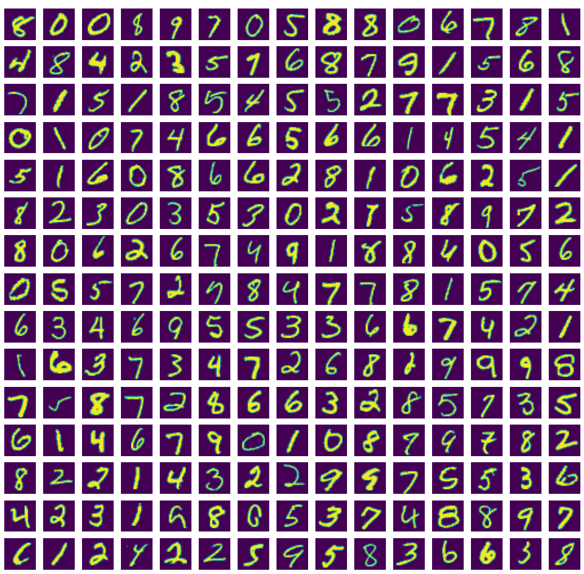

# IMAGE_DENOISING_USING_AUTOENCODERS IN KERAS AND PYTHON

Run the source file in jupyter notebook to see the results.

Requirements:
  <li>Python 3.7
  <li>Install tensorflow
  <li>Install pandas
  <li>Install numpy
  <li>install matplotlib

 

<h2>About Dataset</h2>
MNIST handwritten digit dataset contains 60,000 training and 10,000 testing 28*28 images.,  

  

<h2>Project Overview</h2>
The aim of this project is to remove noise from images in a dataset and give a clear image so that further operations can be done on the dataset effectively.

Autoencoders are deep learning
